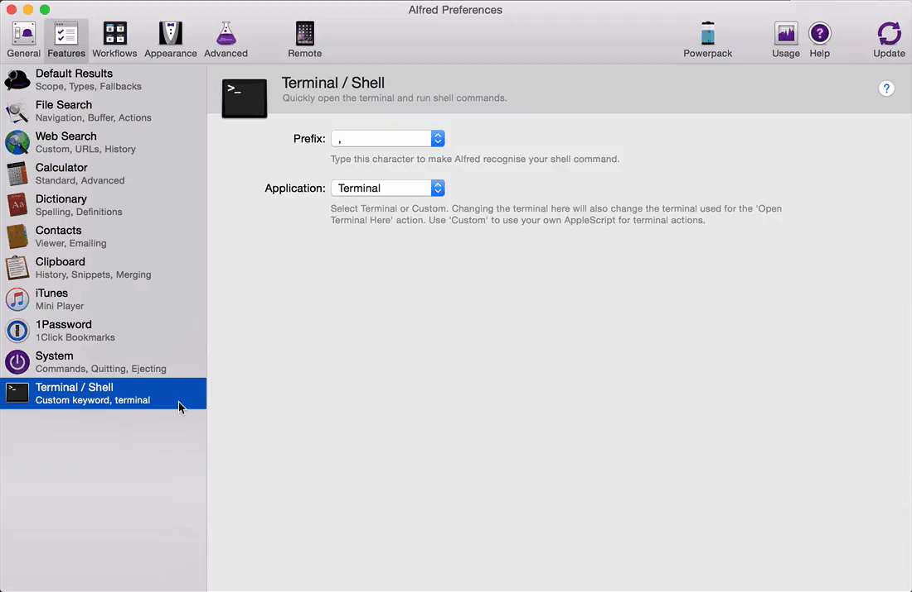

Mac
===

Awesome and wonderful world of Mac

Table of contents
-----------------

- Productivity
  * <<Progamming>>
  * <<Handy Tools>>
- <<References>>

[[Programming]]
Programming
-----------

- JetBrains DataGrip, GoLang, IntelliJ IDEA, PyCharm, WebStorm
- Visual Studio Code
image::https://camo.githubusercontent.com/456f1e620a18af3467f013fdf77630ad5769e930/68747470733a2f2f6d656469612e67697068792e636f6d2f6d656469612f336f36664a356e774f756d4848656a6338552f67697068792e676966[Settings Sync]
image::https://camo.githubusercontent.com/96cf9494901099730fc3f5bb976c9b5e946be5dc/68747470733a2f2f6d656469612e67697068792e636f6d2f6d656469612f78543949676c4b78537173325764777132632f736f757263652e676966[Settings Sync]
image::https://camo.githubusercontent.com/a20ddc60825d99f4a39cd2eaaae34a70c514eb0d/68747470733a2f2f6d656469612e67697068792e636f6d2f6d656469612f78543949676c7369334353396e6f453874572f736f757263652e676966[Settings Sync]
- Xcode

[[Handy Tools]]
Handy Tools
-----------

- Alfred, automatic batch job / workflow on Mac
image::alfred/ASS/Fuzzy Search in Alfred.gif[Fuzzy Search in Alfred]

[[References]]
References
----------

- My wonderful world of macOS, _https://github.com/nikitavoloboev/my-mac-os_