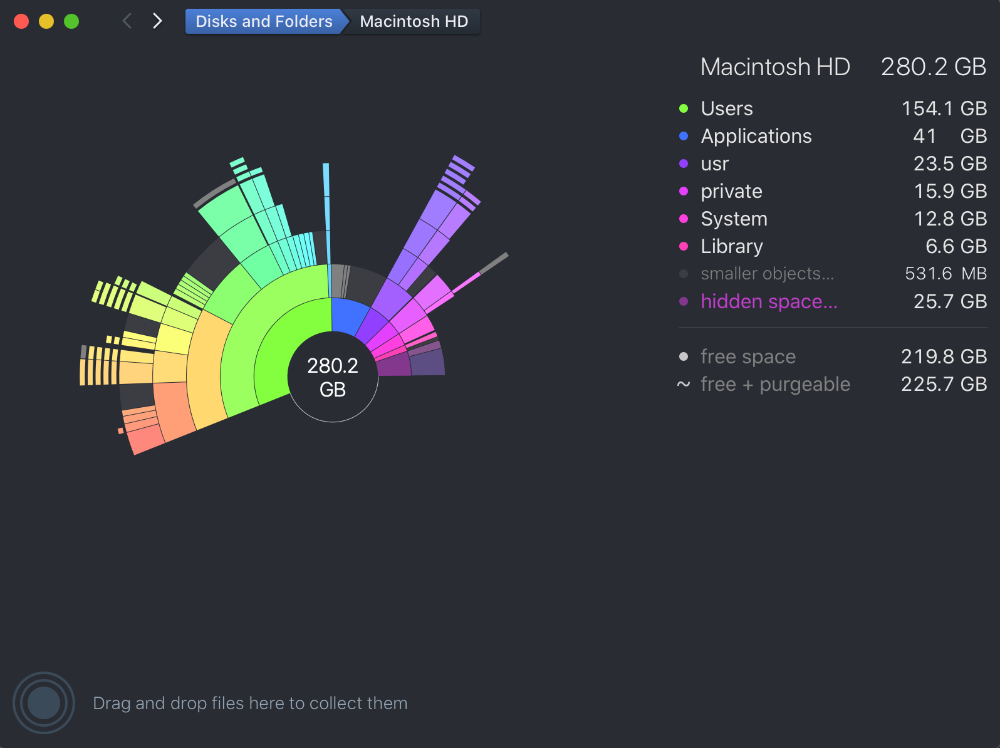
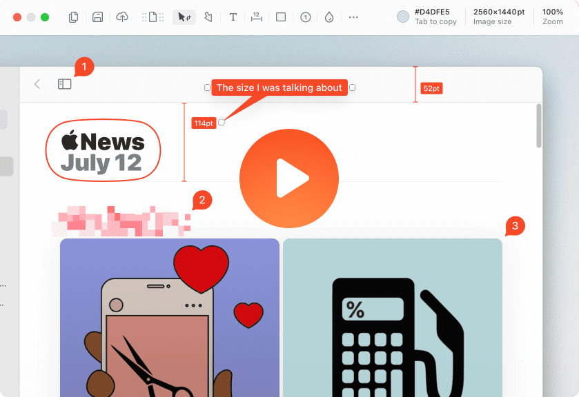
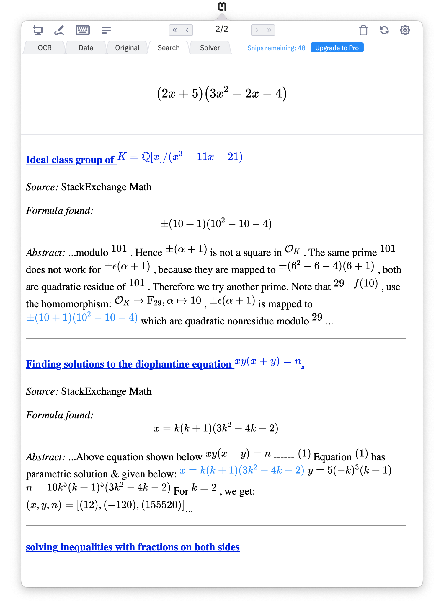

Mac
===

Awesome and wonderful world of Mac

image::Mac{sp}OS.png[Mac OS]

Table of contents
-----------------

- <<Productivity>>
  * <<Programming, Programming way of creativitiy>>
  * <<Quality, Quality Assurance>>
  * <<Tools, Handy Tools>>
  * <<Storage, Cloud Storage>>
  * <<Versioning, Source Version Control>>
  * <<Browsers>>
  * <<Hacking>>
- <<Creativity>>
- <<Office, Office Suite>>
- <<References>>

[[Productivity]]
Productivity
============

[[Programming]]
Programming way of creativity
-----------------------------

JetBrains **DataGrip**, **GoLang**, **IntelliJ IDEA**, **PyCharm**, **WebStorm**

**Visual Studio Code**

- Code Settings Sync

image::https://camo.githubusercontent.com/456f1e620a18af3467f013fdf77630ad5769e930/68747470733a2f2f6d656469612e67697068792e636f6d2f6d656469612f336f36664a356e774f756d4848656a6338552f67697068792e676966[Settings Sync]

- Uploading settings ...

image::https://camo.githubusercontent.com/96cf9494901099730fc3f5bb976c9b5e946be5dc/68747470733a2f2f6d656469612e67697068792e636f6d2f6d656469612f78543949676c4b78537173325764777132632f736f757263652e676966[Settings Sync]

- Downloading settings ...

image::https://camo.githubusercontent.com/a20ddc60825d99f4a39cd2eaaae34a70c514eb0d/68747470733a2f2f6d656469612e67697068792e636f6d2f6d656469612f78543949676c7369334353396e6f453874572f736f757263652e676966[Settings Sync]

**Xcode**

**iTerm2**, a modern terminal solution to replace MacOS Terminal

**fish shell**, a smart, intelligent, self-learning and user friendly command line shell, _https://fishshell.com/_

**Redis Desktop Manager**, a cross-platform open source Redis DB management tool, _https://redisdesktop.com/_

**RazorSQL**, a SQL query tool, database browser, SQL editor, and database administration tool, _https://razorsql.com/_

**Apache Directory Studio**, a complete directory tooling platform intended to be used with any LDAP server

**ForkLift**, the most advanced dual pane file manager and file transfer client for Mac, _https://binarynights.com/_

**KeyStore Explorer**, an open source GUI replacement for the Java command-line utilities keytool and jarsigner, _https://keystore-explorer.org/_

**GPG Suite / GPG Keychain**, GNU Privacy Guard support, _https://gpgtools.org/_

**DB Browser for SQLite**, a high quality, visual, open source tool to create, design, and edit database files compatible with SQLite, _http://sqlitebrowser.org/_

[[Quality]]
Quality Assurance
-----------------

**Postman**, application makes API development simple

**Docker for Mac**

**VirtualBox**

[[Tools]]
Handy Tools
-----------

**Alfred**, automatic batch job / workflow for Mac

- Workflow

image::alfred/ASS/Fuzzy{sp}Search{sp}in{sp}Alfred.gif[Fuzzy Search in Alfred]

- Preferences

image::alfred/ASS/Alfred{sp}Terminal{sp}Custom{sp}-{sp}iTerm2.gif[Alfred Terminal Custom - iTerm2]

**Karabiner**, mechanic keyboard friend, keyboard customiser for Mac, _https://pqrs.org/osx/karabiner/_

**KeepingYouAwake**, a small menu bar utility prevents your Mac from entering sleep mode, _https://keepingyouawake.app/_

- Especially useful when you have multiple desktop, external monitors, have to reset / readjust Windows each time after screen turned off
- Can set up to run depends on battery capacity

**Magnet**, organise your workspace windows accordingly, _http://magnet.crowdcafe.com/_

**Shuttle**, a simple SSH shortcut menu for Mac, easily to integrate with popular iTerm2, _http://fitztrev.github.io/shuttle/_

image::Shuttle.png[Shuttle]

**CheatSheet**, just hold the ⌘-Key a bit longer to get a list of all active short cuts of the current application, as simple as that, _https://www.mediaatelier.com/CheatSheet/_

**Charles**, a HTTP proxy / HTTP monitor / Reverse Proxy that enables a developer to view all of the HTTP and SSL / HTTPS traffic between their machine and the Internet, _https://www.charlesproxy.com/_

**GIPHY Capture**, is the best way to create GIFs on your Mac, _https://giphy.com/apps/giphycapture_

**Paste**, a new way to copy and paste for your Mac, _https://pasteapp.me/_

**Battery Healthe 3 for Mac**, battery management tool, health check, battery information and more, _https://fiplab.com/apps/battery-health-3-for-mac_

**iStat Menus**, an advanced Mac system monitor for your menubar, _https://bjango.com/mac/istatmenus/_

**The Unarchiver**, the top application for archives on Mac, _https://macpaw.com/the-unarchiver_

**Helium**, a floating browser window that allows you to watch media while you work, _http://heliumfloats.com/_

**IINA**, The modern media player for macOS, _https://iina.io/_

image::https://iina.io/images/sc-sky.png[IINA]

**asciinema**, a tool easily to record a terminal session, _https://asciinema.org/a/134269_

image::https://asciinema.org/a/134269.svg[asciinema]

**ack**, a search tool like grep, optimized for programmers, designed for code, built to be a replacement for grep with higher speed and more options, _https://beyondgrep.com/_

[source.console]
----
_   /|
\'o.O'
=(___)=
   U    ack!
----

**ag**, Recursively Search for PATTERN in PATH. Like grep or ack, but faster.

**Fanny**, a free Notification Center Widget and Menu Bar application to monitor your Macs fans, _https://fannywidget.com/_

image::https://fannywidget.com/assets/images/FannyMacOSXWidget.jpg[Fanny Widget]

image::https://fannywidget.com/assets/images/FannyMacOSXMenuBar.jpg[Fanny Menu Bar]

**HazeOver**, Distraction Dimmer, _https://hazeover.com/_

image::https://hazeover.com/images/shots/4-advanced_en-US.jpg[HazeOver]

**Vanilla**, hide menu bar icons, _https://matthewpalmer.net/vanilla/_

image::https://matthewpalmer.net/vanilla/vanilla-square-gif.gif[Vanilla]

- MacOS Big Sur, more space added between icons in menu bar, making MacOS more like iPadOS

- Too many menu bar icons are overlapped in MacOS Big Sur

- With Vanilla installed

**App Cleaner && Uninstaller**, a tool to delete apps on Mac completely and safely, _https://nektony.com/mac-app-cleaner_

**AppCleaner**, allows you to thoroughly uninstall unwanted apps, _https://freemacsoft.net/appcleaner/_

image::https://freemacsoft.net/img/appcleaner.png[AppCleaner]

**Text Scanner - PDF & Document**, a powerful image scanning tool based on AI's leading deep learning algorithm that uses optical character recognition technology to convert text content directly into editable text, _https://apps.apple.com/au/app/text-scanner-pdf-document/id1452523807_

**DaisyDisk**, a disk space analyzer for macOS. It displays a sunburst diagram of files on a hard drive to help with the location or deletion of large files. It can display previews of files using Quick Look. It also allows the user to look at the file directly in Finder, in order to delete it or move it elsewhere, _https://daisydiskapp.com/_

**balenaEtcher**, Flash OS images to SD cards & USB & DVD drives, safely and easily, _https://www.balena.io/etcher_

Build bootable image in DVD.

Build bootable image in USB sticker.

**Vysor**, A windows to your Android, _https://www.vysor.io/_

**Paw**, a full-featured HTTP client that lets you test and describe the APIs you build or consume. It has a beautiful native macOS interface to compose requests, inspect server responses, generate client code and export API definitions, _https://paw.cloud/_

**Inkscape**, is a Free and open source vector graphics editor. It offers a rich set of features and is widely used for both artistic and technical illustrations such as cartoons, clip art, logos, typography, diagramming and flowcharting. It uses vector graphics to allow for sharp printouts and renderings at unlimited resolution and is not bound to a fixed number of pixels like raster graphics, _https://inkscape.org/_

image::Inkscape.png[Inkscape]

**blankscreen**, it might seem hard to believe, but Apple does not include a simple, blank screen saver with macOS.

Just a simple, blank screen saver for your Mac, _https://intelliscapesolutions.com/screensavers/blankscreen_

**Send Anywhere**, transfer files between e.g. Mac and Android via WiFi or internet. No login access required, _https://send-anywhere.com/product_

**CleanMyMac X**, delete system junk, unwanted apps and malware, and tune your Mac for maximum speed, _https://cleanmymac.com/_

video::https://cdn.cleanmymac.com/video/main_topper.mp4[width=720,opts=autoplay,loop]

**MonitorControl**, for Apple Silicon and Intel, controls your external display brightness and volume and shows native OSD. Use menulet sliders or the keyboard, including native Apple keys, https://github.com/MonitorControl/MonitorControl

**AltTab**, brings the power of Windows’s “alt-tab” window switcher to MacOS, cycling through apps or same active app, _https://alt-tab-macos.netlify.app/_

*shottr***, is a small, fast, human-sized screenshot app built for those who care about pixels. It was crafted with Swift, optimized for M1, and is distributed for free, _https://shottr.cc/_

https://shottr.cc/assets/154-shottr-demo.mp4[]

Testing

ifdef::env-github[]
image:https://img.youtube.com/vi/rAteGra5-xM/maxresdefault.jpg[link=https://youtu.be/rAteGra5-xM]
endif::[]

ifndef::env-github[]
video::rAteGra5-xM[youtube]
endif::[]

**OnyX**, is a multifunction utility that you can use to verify the structure of the system files; run miscellaneous maintenance and cleaning tasks; configure parameters in the Finder, Dock, Safari, and some Apple applications; delete caches; remove certain problematic folders and files; rebuild various databases and indexes; and more, _https://www.titanium-software.fr/en/onyx.html_

image::OnyX.png[OnyX]

[[Storage]]
Cloud Storage
-------------

**Google Drive**

**Apple iCloud**

**Microsoft OneDrive**

[[Versioning]]
Source Version Control
----------------------

**SourceTree**, a Git GUI that offers a visual representation of your repositories

**P4Merge**, track and compare the effects of past and pending work for branches and individual files

[[Browsers]]
Browsers
--------

**Chrome**

**Firefox**

**Safari**, now can stream 4K HDR and Dolby Vision content with MacOS Big Sur.

- HDR video in Chrome

image::HDR video in Chrome.png[HDR video in Chrome]

- HDR video in Safari

image::HDR video in Safari.png[HDR video in Safari]

[[Hacking]]
Hacking
-------

**Hopper Disassembler**, the reverse engineering tool that lets you disassemble, decompile and debug your applications, _https://www.hopperapp.com/_

**Class-dump**, is a command-line utility for examining the Objective-C runtime information stored in Mach-O files. It generates declarations for the classes, categories and protocols, _http://stevenygard.com/projects/class-dump/_

**Hex Fiend**, a fast and clever open source hex editor for macOS, _https://hexfiend.com/_

[[Creativity]]
Creativity
==========

Adobe **Acrobat**, **Illustrator**, **InDesign**, **Lightroom**, **Photoshop**, **Premiere Pro**

**Sketch**, a design toolkit built to help you create your best work — from your earliest ideas, through to final artwork, _https://www.sketchapp.com/_

**Snagit**, the only screen capture software with built-in advanced image editing and screen recording, _https://www.techsmith.com/screen-capture.html_

**XMind**, the most professional and popular mind mapping tool, _https://www.xmind.net/_

**Lucidchart**, create professional flowcharts, process maps, UML models, org charts, _https://www.lucidchart.com/_

- Dependencies Tree

image::Lucidchart{sp}dependencies{sp}tree.png[Lucidchart dependencies tree]

- Gantt Chart

image::Lucidchart{sp}gantt{sp}chart.png[Lucidchart gantt chart]

- Workflow

image::Lucidchart{sp}workflow.png[Lucidchart workflow]

**Cloudcraft**, visualize your AWS environment as isometric architecture diagrams, _https://cloudcraft.co/_

image::Cloudcraft.png[Cloudcraft]

**Aerial screen saver**, Apple TV Aerial Views Screen Saver, _https://github.com/JohnCoates/Aerial_

image::https://cloud.githubusercontent.com/assets/499192/10754100/c0e1cc4c-7c95-11e5-9d3b-842d3acc2fd5.gif[Aerial screen saver]

**Audio Hijack**, if you can hear it, you can record it, _https://rogueamoeba.com/audiohijack/_

image::https://rogueamoeba.com/audiohijack/images/hero-banner-large.png[Audio Hijack Watch Overview]

**ScreenFlow**, video editing & screen recording, _http://www.telestream.net/screenflow/overview.htm_

image::https://www.telestream.net/company/press/images/PressImage-ScreenFlow8.jpg[ScreenFlow]

**MindNode**, the most delightful mind mapping app for Mac and iOS. It helps you capture your thoughts and create a clear picture of your idea, _https://mindnode.com/_

image::MindNode.gif[MindNode]

**CMatrix**, is based on the screensaver from The Matrix website. It shows text flying in and out in a terminal like as seen in "The Matrix" movie. It can scroll lines all at the same rate or asynchronously and at a user-defined speed, _https://codeburst.io/install-and-setup-cmatrix-on-mac-a2076daee420_

image::https://media.giphy.com/media/yl3XErRq8qmmA/giphy.gif[Matrix]

**Jubler**, Jubler is a tool to edit text-based subtitles. It can be used as an authoring software for new subtitles or as a tool to convert, transform, correct and refine existing subtitles, _https://www.jubler.org/_

**Bartendar**, a tool is giving you total control over your menu bar items, what's displayed, and when, with menu bar items only showing when you need them, _https://www.macbartender.com/_

**mathpix Snip Tooling**, a tool for extracting text, and particularly math, from images and documents, _https://mathpix.com/_

**TinkerTool**, an application that gives you access to additional preference settings Apple has built into macOS. This allows to activate hidden features in the operating system and in some of the applications delivered with the system, _https://www.bresink.com/osx/TinkerTool.html_

[[Office]]
Office Suite
============

Apple **Numbers**, **Pages**, **Keynote**

image::Apple{sp}Keynote.png[Apple Keynote]

[[References]]
References
==========

- My wonderful world of macOS, _https://github.com/nikitavoloboev/my-mac-os_
