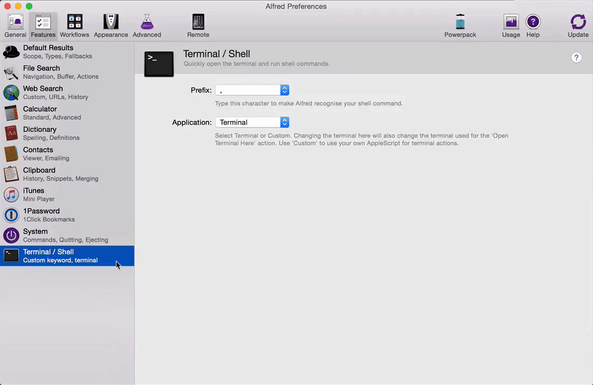

ifdef::env-github[]
:tip-caption: :bulb:
:note-caption: :information_source:
:important-caption: :heavy_exclamation_mark:
:caution-caption: :fire:
:warning-caption: :warning:
endif::[]

ASS (AWS SSH Simple)
====================

For security reason, AWS cloud environment used to have SSH jumpbox / bastion host setup for direct access to EC2 instances.

NOTE: Logon AWS EC2 instances can be easier even there is a jump box sitting in the middle, blocking you do thing fast.

Introduce AWS SSH Simple script, and with fuzzy hosts search, on awesome powerful Alfred.

image::Fuzzy Search in Alfred.gif[Fuzzy Search in Alfred]

TIP: It works!

Alfred Terminal Custom iTerm2
-----------------------------

References
----------

- Fuzzy search for Alfred 3, _https://github.com/deanishe/alfred-fuzzy_
- iTerm2 Alfred integration, _https://github.com/stuartcryan/custom-iterm-applescripts-for-alfred_
- New CloudFormation Templates - VPC bastion host, Jenkins, Security AWS Config, _https://cloudonaut.io/new-cloudformation-templates-vpc-bastion-host-jenkins-security-aws-config/_